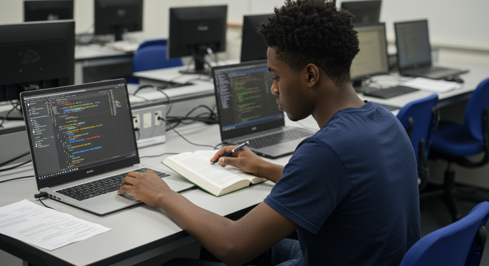

# INFO2180 Lab 1

This is Lab 1 for Gavin Seaton, part of the INFO2180 Web Development course.

## 📄 Overview

This lab introduces basic HTML and CSS concepts. It includes:
- A personal webpage (`index.html`)
- A custom stylesheet (`styles.css`)
- An image (`higher_learning.jpg`)

## 🌱 Branching

Branching allows you to isolate development work without affecting other branches in the repository. Each repository has one default branch (usually called `main`), and can have multiple other branches.

In this lab, a `webpage` branch was created to develop the HTML and CSS files. Once completed, it was merged back into the `main` branch.

## 🚀 How to Run

To view the webpage locally:
1. Clone the repository
2. Open`localhost/info2180-lab1/` in your browser with xamp server running

## 📷 Screenshot

## 👤 Author

**Gavin Seaton**  
Passionate about technology and problem-solving. Interested in web development for its ability to create interactive and impactful applications.

## 📅 Date

September 2025
